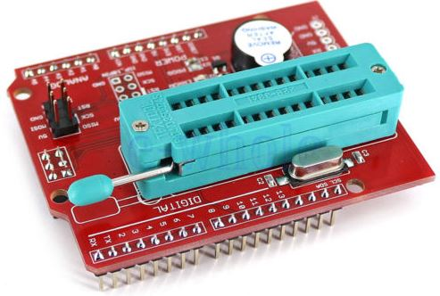
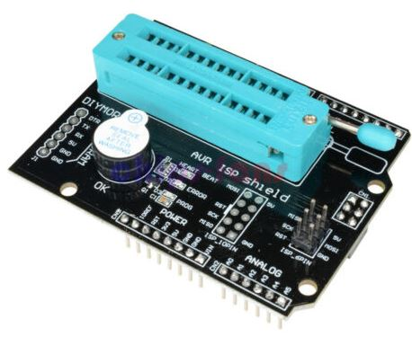
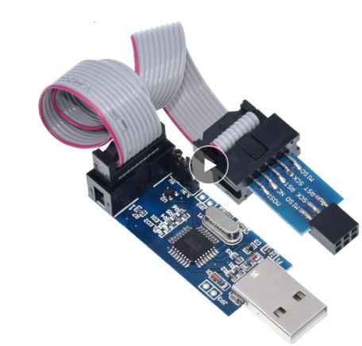

# Arduino Chip (ATMega328P) Programming Tools
Some essential (but cheap) bits of kits to make programming the Arduino microcontroller very straightforward

### LCSC Electronics - Shop Online: https://lcsc.com
#### $8 off your first order at LCSC Electronics with https://lcsc.com/?href=ralphsbacon&source=referral

## See https://www.youtube.com/ralphbacon video #163
### Direct link to video: https://youtu.be/hY5aydgilTk

<image src="images/Shield_Programmer.JPG" align="right">
We're all used to programming an Arduino board using just a single USB cable, but what do you do when you want a bespoke PCB with an ATMega328P (Arduino Uno chip) in it? How do you program it? And run it without a crystal?

Using a couple of cheap (as a cup of coffee house coffee) tools we can program any ATMEGA328P chip (and several others besides, but let's not get ahead of ourselves).

These bit of electronic wizardry let us but new bootloaders, change the *fuses* (one bit flags) on the chip to alter its hardware behaviour and, of course, let us upload our latest and greatest compiled sketch.

I'm telling you all this so that you can be prepared for the next raft of projects I'm embarking on and that you might want to modify for your own purposes. To program the chips, you'll need these simple tools. Buy once, have for life!

Oh yes, I also recorded about 30 minutes of video on how to convert a circuit diagram to a PCB, and all the steps you need to take, but this is still lying on the cutting room floor. There was basicially no time left to include this quite detailed information, so we'll leave that for another day.

I'd love your comments, questions and general constructive observations so please feel free to comment on the video.

Here are the links to (most) of the products we looked at in the video. Some may be affiliate links that help my channel. Others are not but I don't discriminate either way.

### List of all my videos 
(Special thanks to Michael Kurt Vogel for compiling this)  
http://bit.ly/VideoList-RalphBacon

## Links

Official (as it can be) OPEN SMART AVR ISP Shield Bootloader Programmer with buzzer and LED indicator  
http://s.click.aliexpress.com/e/snN0a5Ws  

**Red programming shield** that I found on eBay (UK link but available worldwide):  
https://www.ebay.co.uk/itm/AVR-ISP-Shield-Burning-Bootloader-Programmer-for-Arduino-UNO-R3-WT-/172443238667

  

Ali Express **Black version** of the AVR ISP Shield (there are several):  
http://s.click.aliexpress.com/e/dADT1zf2  
 

  

AliExpress **USBASP programmer** a steal at under $2 (look around for others):   
http://s.click.aliexpress.com/e/mI7VMddq or  
http://s.click.aliexpress.com/e/ouak0z72   

Banggood's USBASP v2.0 programmer (NB you need a 10-pin to 6-pin adapter see next item):  
https://www.banggood.com/USBASP-USBISP-AVR-Programmer-USB-ISP-USB-ASP-ATMEGA8-ATMEGA128-Support-Win7-64K-p-1497716.html?p=FQ040729393382015118&utm_campaign=25129675&utm_content=3897  

**10-pin to 6-pin adapter**, for Banggood's USBASP programmer, just over $1:  
https://www.banggood.com/10-Pin-To-6-Pin-Adapter-Board-Connector-For-Arduino-ISP-Interface-Converter-AVR-AVRISP-USBASP-STK500-Standard-p-1413166.html?p=FQ040729393382015118&utm_campaign=25129675&utm_content=3897  

Geekcreit **FT232RL FTDI USB To TTL Serial Converter** Adapter Module For Arduino, on offer at $1.99 until 1st October 2019:  
https://www.banggood.com/FT232RL-FTDI-USB-To-TTL-Serial-Converter-Adapter-Module-For-Arduino-p-917226.html?p=FQ040729393382015118&utm_campaign=25129675&utm_content=3897  

### List of all my videos  
(Special thanks to Michael Kurt Vogel for compiling this)   
http://bit.ly/YouTubeVideoList-RalphBacon

If you like this video please give it a thumbs up, share it and if you're not already subscribed please consider doing so and joining me on my Arduinite journey  

My channel and blog are here:  
\------------------------------------------------------------------  
https://www.youtube.com/RalphBacon  
https://ralphbacon.blog  
\------------------------------------------------------------------

